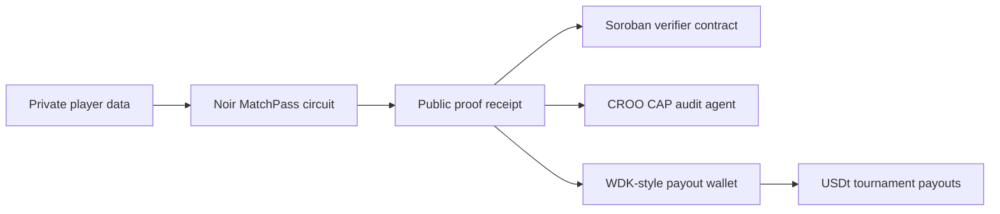

# ProofCup

ProofCup is a privacy-preserving tournament payout and roster verification stack for three open hackathons:

- Stellar Hacks: Real-World ZK: private roster eligibility proofs, public nullifiers, and a Soroban receipt-aware proof gate.
- CROO Agent Hackathon: a paid callable audit agent that checks proof receipts, payout manifests, and tournament risk.
- Tether Developers Cup: a football-themed WDK wallet and payment flow for self-custodial USDt prize operations.

The demo focuses on one concrete workflow: a player proves they are eligible for a global football tournament payout without exposing their identity. The same proof receipt can be posted to Stellar, audited by a CROO CAP agent, and used inside a Tether WDK-style payout wallet.

## Local Demo

```bash
pnpm install
pnpm test
pnpm proof:demo
pnpm nargo:compile
pnpm nargo:execute
pnpm proof:prove
pnpm proof:verify
pnpm soroban:test
pnpm soroban:build
pnpm judge:evidence
pnpm agent:smoke
pnpm tether:demo
pnpm dev
```

## Verified Evidence

- Live demo: https://oxygen56.github.io/proofcup/
- Noir circuit compiles and solves witness: `proofcup/circuits/matchpass/src/main.nr`.
- Barretenberg proof verifies natively:
  - proof: `zk-artifacts/matchpass/proof.json`
  - verification key: `zk-artifacts/matchpass/vk.json`
  - public inputs: `zk-artifacts/matchpass/public_inputs.json`
- Stellar testnet receipt anchor:
  - transaction: `2fd0119b5ae81f695d81f38a29efa440e9f05009b08463071f8c942608159681`
  - explorer: https://stellar.expert/explorer/testnet/tx/2fd0119b5ae81f695d81f38a29efa440e9f05009b08463071f8c942608159681
- Stellar Soroban verifier:
  - contract: `CBNGZ5V25IPGHVBTNSM7GQSZVHDMAZCFZDTL6S2DZTDEZSYHCTKKU3MK`
  - lab: https://lab.stellar.org/r/testnet/contract/CBNGZ5V25IPGHVBTNSM7GQSZVHDMAZCFZDTL6S2DZTDEZSYHCTKKU3MK
  - upload tx: https://stellar.expert/explorer/testnet/tx/4ea12b85852773534e3545369721817f170b9f5bbee92a788e582ba340a11776
  - deploy tx: https://stellar.expert/explorer/testnet/tx/76bb73b269c1364ec913cca999eaedecaeb8937ab2b0bb432c24bc22bd803758
  - verify tx: https://stellar.expert/explorer/testnet/tx/cd5cee33bdedfbb1c6283718d1e384a8f8244046025d35068feed708157c4fa6
  - wasm: `target/stellar/matchpass_verifier.wasm`
  - deployed wasm hash: `00ab41ca13a91887708f3e6f288c07f79aacc2922f6a85bd5eb838f932994603`
  - upgraded receipt-gate wasm hash: `b9df30cfad86d0793357742c2baa22d436494488d36b35c81d8bfd16ad97f9e4`
  - judge evidence matrix: `docs/JUDGE_EVIDENCE_MATRIX.md`
  - UltraHonk bridge notes: `docs/ULTRAHONK_BRIDGE.md`
  - receipt gate hash: `9f9255f69868fb538dd6c12a663439b807c76990e1166fbd8dc136b5c92acbaa`
  - receipt gate functions: `verify_matchpass_receipt`, `receipt_hash`, `receipt_verified`, expected artifact hash getters, and duplicate-nullifier checks.
- CROO-style HTTP agent:
  - `pnpm agent:serve`
  - `GET /health`, `GET /sample`, `POST /audit`, `POST /payout-intent`
- Tether Cup WDK flow:
  - `pnpm tether:demo` emits a policy-checked USDt payout batch.

## Submission Packages

- `../submissions/proofcup/STELLAR_ZK.md`
- `../submissions/proofcup/CROO_AGENT.md`
- `../submissions/proofcup/TETHER_DEVELOPERS_CUP.md`

## Architecture


