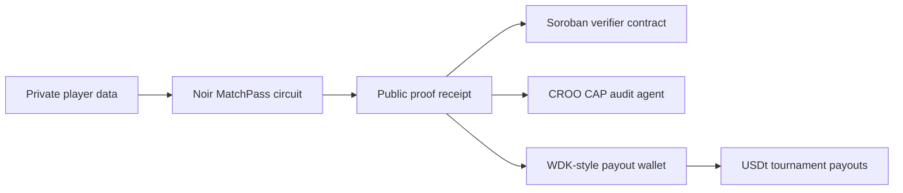

# ProofCup

ProofCup is a privacy-preserving tournament payout and roster verification stack for three open hackathons:

- Stellar Hacks: Real-World ZK: private roster eligibility proofs, public nullifiers, and a Soroban verifier interface.
- CROO Agent Hackathon: a paid callable audit agent that checks proof receipts, payout manifests, and tournament risk.
- Tether Developers Cup: a football-themed WDK wallet and payment flow for self-custodial USDt prize operations.

The demo focuses on one concrete workflow: a player proves they are eligible for a global football tournament payout without exposing their identity. The same proof receipt can be posted to Stellar, audited by a CROO CAP agent, and used inside a Tether WDK-style payout wallet.

## Local Demo

```bash
pnpm install
pnpm test
pnpm proof:demo
pnpm nargo:compile
pnpm nargo:execute
pnpm proof:prove
pnpm proof:verify
pnpm agent:smoke
pnpm tether:demo
pnpm dev
```

## Verified Evidence

- Noir circuit compiles and solves witness: `proofcup/circuits/matchpass/src/main.nr`.
- Barretenberg proof verifies natively:
  - proof: `zk-artifacts/matchpass/proof.json`
  - verification key: `zk-artifacts/matchpass/vk.json`
  - public inputs: `zk-artifacts/matchpass/public_inputs.json`
- Stellar testnet receipt anchor:
  - transaction: `2fd0119b5ae81f695d81f38a29efa440e9f05009b08463071f8c942608159681`
  - explorer: https://stellar.expert/explorer/testnet/tx/2fd0119b5ae81f695d81f38a29efa440e9f05009b08463071f8c942608159681
- CROO-style HTTP agent:
  - `pnpm agent:serve`
  - `GET /health`, `GET /sample`, `POST /audit`, `POST /payout-intent`
- Tether Cup WDK flow:
  - `pnpm tether:demo` emits a policy-checked USDt payout batch.

## Submission Packages

- `../submissions/proofcup/STELLAR_ZK.md`
- `../submissions/proofcup/CROO_AGENT.md`
- `../submissions/proofcup/TETHER_DEVELOPERS_CUP.md`

## Architecture


